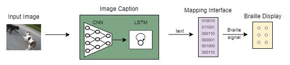
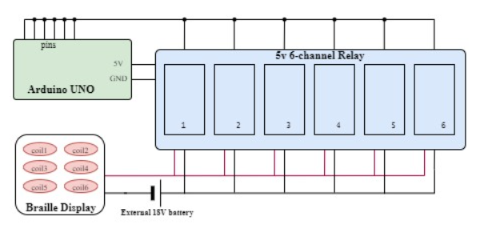
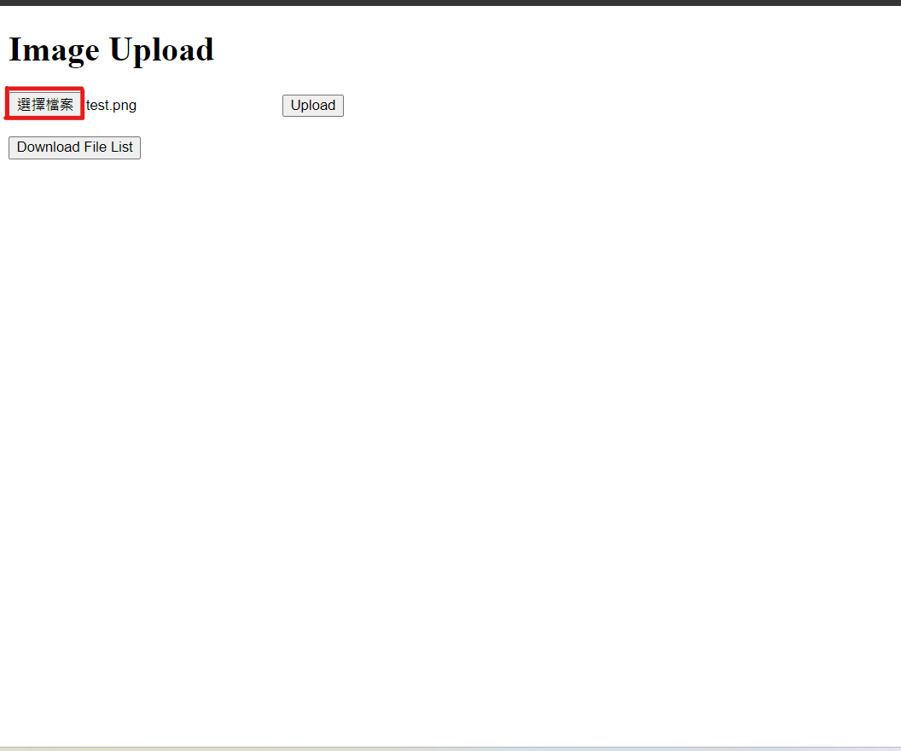
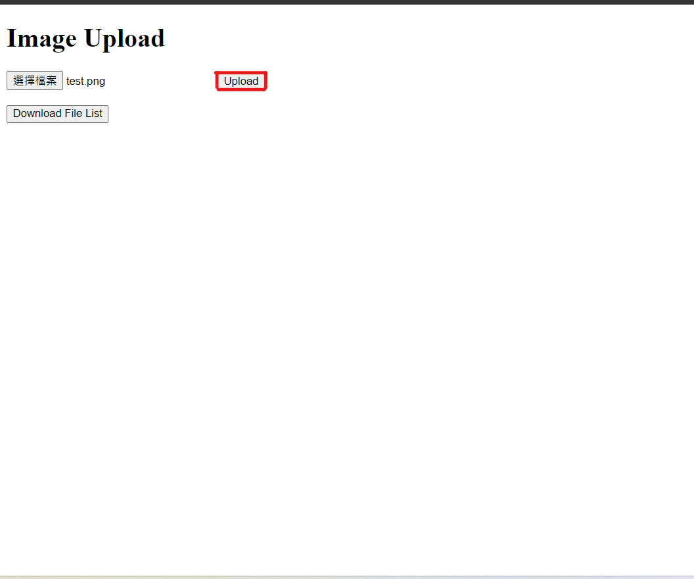
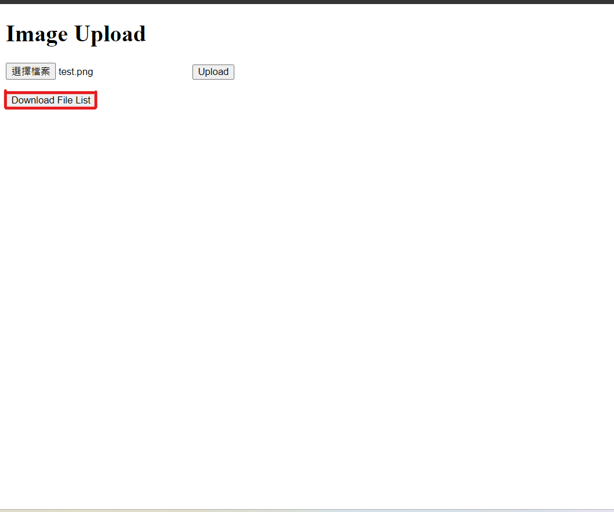
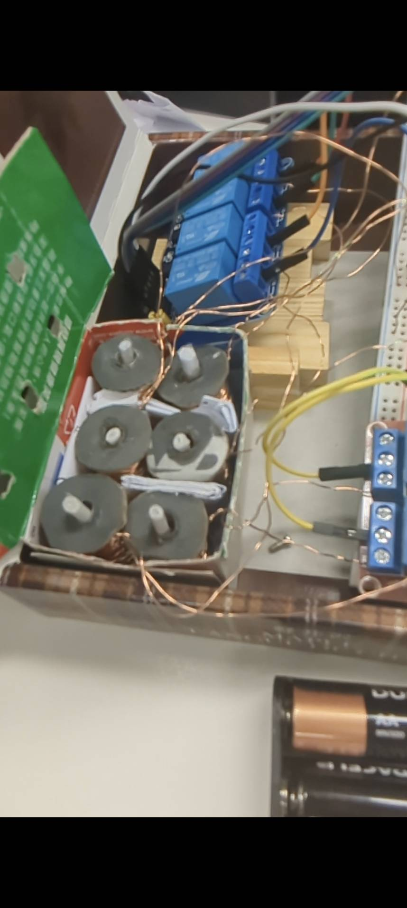
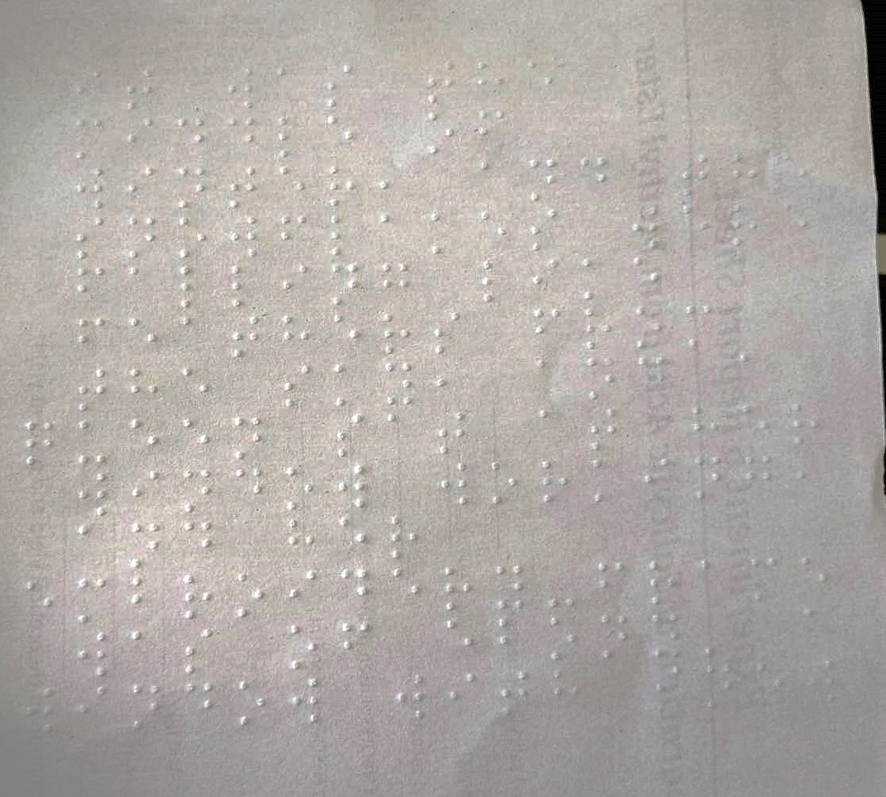

## Main Idea
In this work, we develop a system which uses an image caption model and converts its text output into a braille display to aid the visually impaired. Our team provides two displays, one is a refreshable braille display, the other is a braille typewriter.  And we end up successfully making the first approach by electromagnetic and for the second one, we modify a 3d printer to achieve it.
<div align="center">
    <a href="./">
        
    </a>
</div>

## Factility Required
### For refreshable display
```shell
breadboard
dupont line 
enameled wire
iron nail
6-channel ralay 
18-Volt battery
```

<div align="center">
    <a href="./">
        
    </a>
</div>

### For braille typewriter
```shell
a 3d printer
```

## Setup instructions for working environments
```shell
pip install Pillow
pip install keras
pip install tqdm
pip install transformers
pip install torch
```

## Code execution instructions
### For refreshable display
1. install arduino IDE
https://www.arduino.cc/en/software

2. open [braille.ino] through arduino IDE
3. input command in anaconda prompt
```shell
python ImagetoBrailleDisplay.py [your_picture_file] [the model you want to use]
```

example to use model 1:
```shell
python ImagetoBrailleDisplay.py test 1
```

### For braille typewriter
1. input command in anaconda prompt
```shell
flask run
```
2. open the local website
http://127.0.0.1:5000

3. upload the image file
<div align="center">
    <a href="./">
        
    </a>
</div>

4. convert and download
<div align="center">
    <a href="./">
        
    </a>
</div>
<div align="center">
    <a href="./">
        
    </a>
</div>

## Output examples
| Text Input | Braille Typewritter |
| :-- | :-: |
| i love u | <div align="center"><a href="./"></a></div> |

| Text Input | Braille Typewritter |
| :-- | :-: |
| It was the middle of winter, and the snowflakes were falling like feathers from the sky, and a queen sat at her window working, and her embroidery-frame was of ebony.  a window with snow on it| <div align="center"><a href="./"></a></div> |

## Performance details
For the model, we will use bleu-4 score to evaluate the performance

Model 1's bleu-4 score is

Model 2's bleu-4 score is

For the display, we will use the speed to generate char to evalute the performance.

Refreshable display's char per second is 0.375.

typewriter's char per second is 0.325.

## Demo video
For refreshable braille display

https://github.com/Sen1127/Image-Caption-Braille-Display/assets/119402514/299c4f27-5a2f-4671-a8de-dad0b67be1b0

For braille typewriter

https://github.com/Sen1127/Image-Caption-Braille-Display/assets/119402514/175bb788-e69b-4461-a216-ee4ae170d7d6


